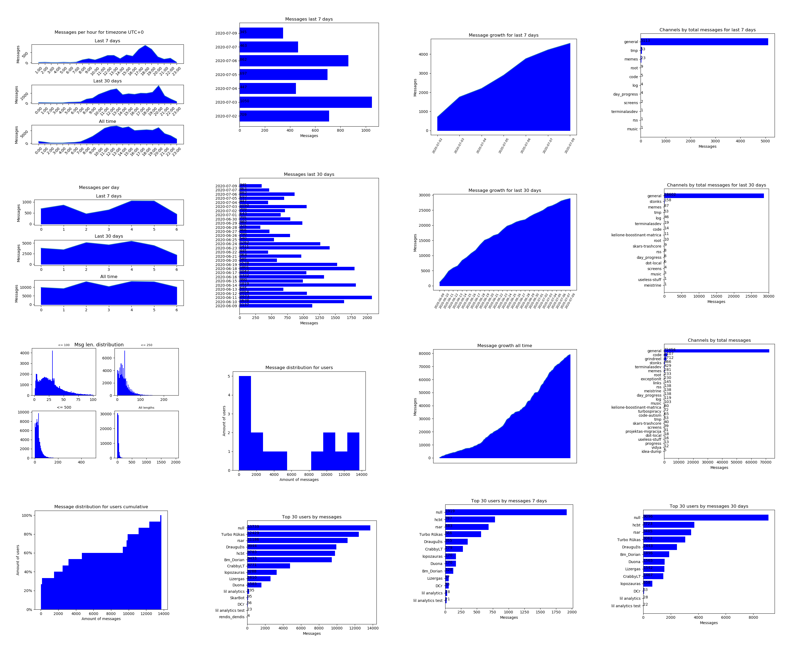
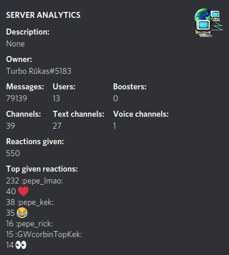
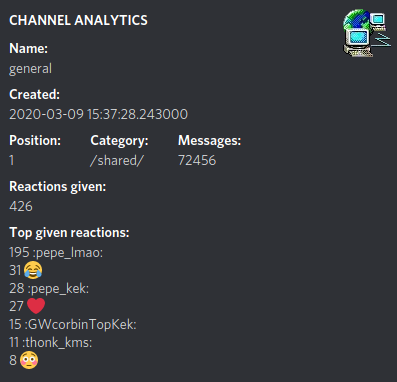
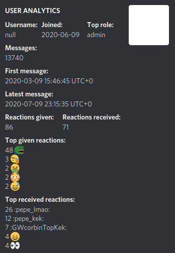

# lil analytics :robot:
Discord bot for server/user/channel analytics. Gathers message metadata and generates Matplotlib graphs.
**Does not collect content of the messages!** You can find data that is collected in ddl.py module. It contains the database schema.
If you will run this bot from source, make sure to use `.index` first, to index your whole server. Parsing history takes a long time, and really depends on your hardware. Raspberry Pi Zero will work for a small server. Anything bigger requires better CPU.
Commands generate compilation of statistics and send one embed together with additional stats:









# Commands

## Analysis

```
.user usermention (timezone)
.user @jesus 1
	Show statistics of mentioned user.
	Can give timezone offset for UTC time, 1 means UTC+1.
	Timezone is optional, default is UTC time.

.server (timezone)
.server -5
	Show statistics of server.
	Can give timezone offset for UTC time, -5 means UTC-5.
	Timezone is optional, default is UTC time.


# Not implemented yet!
.userchannel usermention channelmention (timezone)
.userchannel @joe #nsfw
	Show statistics for mentioned user for a specific channel.
	Takes one user mention and one channel mention.
	Timezone is optional, default is UTC time.
	
.index
	Indexes messages in the server from the beginning.
	TAKES A LONG TIME!
```


## General

```
.help
	Short TLDR about commands. Link to this page.

.info
	Print information about the bot and links to documentation, invite link.
	
.avatar <mention(s)>
	Return profile picture in complete size of mentioned user(s).
	
.userinfo <mention(s)>
	Returns information about mentioned user(s).
```


## Administration

```
.kick <mention>
	Kick mentioned user.

.ban <mention>
	Ban mentioned user.

.clear <amoount int>=0 or "all">
	Delete given amount of messages. "all" will delete all messages!
	There is no way back from .clear all.
    It will completely nuke the channel it was called in.
    
.gdpr
	Delete all your messages in channel where command was called.
	Takes a long time.
```


## Fun (will be gone in production)

```
.8ball/8b <input>
	Classic 8ball that can answer your questions. 
	Do not use for serious life choices.

.c <input with separator=;>
	Picks one of your choices separated by ;
	
.b
	Converts your text into emoji text. 
	Only ASCII letters a-z and numbers 0-9 are converted.
	Other info is removed.
```


## Owner

Commands that can only be executed by the person who has the *sudo* rights in the settings file.

```
.unload <cog>
.load <cog>
	Load and unload specific cogs to turn off functions.

.cogs
	Print all available cogs from src/cogs.
```


# Developers

## Structure

- All logs are saved data/logs/ directory. Logs are rotated daily, but old logs are not deleted.
- There is one database called data in data/databases/ directory. You can modify this in definitions.py.
- All bot code is located in src/ directory. definitions.py is located in root directory.


## Booting Bot

1. Create a bot and get the API key from [discord.com](https://discord.com/developers/applications). You have to create an application, then a bot for it. Then you will get a token.

2. Fill out required data in .definitions.py and rename it to definitions.py.

3. (Optional) Create a venv in the source dir. Or you can just use global interpreter. Activate your environment with `$ source venv/bin/activate`.

4. Run toolbox.sh and pick setup option. It will install dependencies and create required directories/files.

8. Start the bot with `$ python3 lil_analytics/` or `$ python3 .` if you are inside the source directory.


## Roadmap

- [x] Export path in program, so the user wont have to DIY.
- [ ] Runner that sets up different loggers, one for function calls, one for performance analysis generators, one for debug. All need to be rotated and saved in logs/
- [ ] Discord invite with less permissions, admin is not needed after alpha/debug phase
- [ ] flake8, pytest, automatic check on master push with actions. pep8 rules.
- [x] Migrate to definitions.py from settings.json
