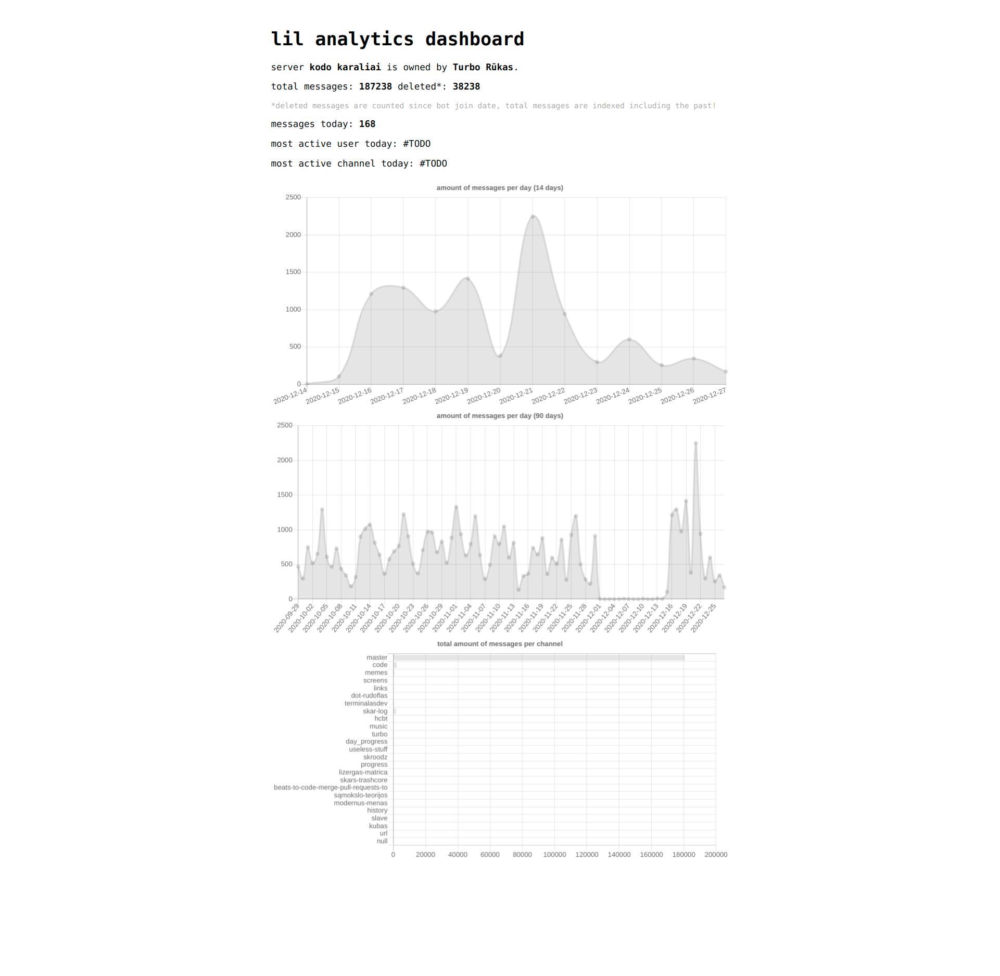

# lil_analytics

**VERSION BETA**

Message metadata analytics bot. Collects messages on write/edit/delete and displays charts. This version of lil analytics is split into two docker containers, one for bot and another for api. Previous version used matplotlib to generate images and upload them to discord. This version uses fastapi and chart.js to create dashboards. Everything works 100000x faster.

You can check master branch to find the old version, which will be kept as an archive. (It works btw.)




## commands
```
.index 
    index all available messages in the guild. requires you to be the owner. 
    set owner_id in .env!
 
.kick .ban <user mention>
    your "common" commands to manage users.

.clear <int> or "all"
    delete messages in the channel. can give a number or word all.
    requires message management permissions.
    use with care. it has the ability to nuke a channel. no undo!

.gdpr <user mention>
    delete all messages in the called channel by mentioned user.
    no undo. handle with care. very slow, since all messages have to be iterated.
    might take DAYS to complete. discord rate-limits history iteration :^)

.c <a;b;c>
    choose between choices separated by ";"

.8ball
    you know what 8ball is, the hello world of discord bot development.

```

## tech stack
- FastAPI serves frontend and api.
- SQLite stores indexed message metadata.
- Discord.py bot sniffs information and throws it to api.
- Makefile(the OG Action) to build, lint, clean code.
- Chart.js for dashboard graphs.
- AnyChart.js for heatmap, since Chart.js lacks that...


## TODO
Read TODO file if you want to help :')

## install && deploy
1. Create and fill out env file: `$ mv .env.example .env`!
    1.1 You will need to create a Discord bot, or use existing one.
2. Run `$ sudo docker-compose up -d`.
3. Go to [localhost:9998](https://localhost:9998) if you left default api port.
4. Configure reverse proxy of your choice. I use NGINX, example config can be found in root dir of the project.
4. Enjoy your spyware bot 🤖
5. Do not forget to pull updates regularly. I will try to not make any breaking changes ;)

